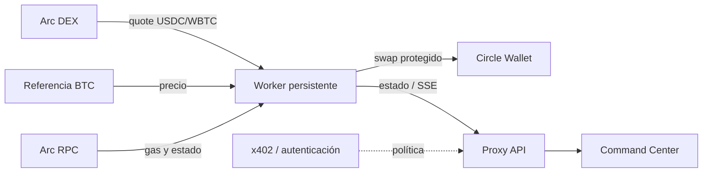

# ArcBitrage — Pitch deck

> **Versión:** agosto de 2026
> **Propósito:** conversación con aliados, programas de ecosistema e inversionistas pre-seed.
> **Estado:** prototipo funcional en modo seguro; las cifras de negocio señaladas como “objetivo” no son resultados históricos.

---

## 1. Portada — Liquidity intelligence, ejecutada a velocidad de mercado

### **ArcBitrage**

**Una capa autónoma de inteligencia y ejecución para detectar, evaluar y operar ineficiencias de liquidez en Arc.**

- Primer flujo: oportunidades **USDC → WBTC** en un DEX compatible con Uniswap V2.
- Operación desde una **Circle Developer-Controlled Wallet**.
- Riesgo operativo visible: gas, spread, slippage, estado y trazabilidad en un solo Command Center.

**Frase para abrir:** “El mercado no pierde oportunidades por falta de datos; las pierde porque analizar, decidir y ejecutar todavía son procesos separados.”

---

## 2. Problema — La liquidez fragmentada crea una brecha de ejecución

Los operadores que buscan capturar desalineaciones de precio enfrentan cuatro fricciones:

1. **Señales dispersas:** cotización onchain, referencia externa y gas viven en herramientas diferentes.
2. **Decisiones lentas:** una oportunidad puede desaparecer entre la alerta, el cálculo y la firma.
3. **Riesgo invisible:** un spread bruto atractivo puede dejar de ser rentable al descontar gas, slippage y costos de salida.
4. **Operación difícil de escalar:** ejecutar con wallets, políticas y controles propios exige infraestructura especializada.

### Consecuencia

Más tiempo frente a pantallas, señales que no se convierten en ejecución y estrategias cuyo riesgo real se conoce demasiado tarde.

**Mensaje clave:** ArcBitrage no vende “rentabilidad garantizada”; convierte una operación fragmentada en un flujo medible, automatizable y gobernable.

---

## 3. Oportunidad — Agentes financieros con controles institucionales

La infraestructura necesaria ya converge:

- **Mercados onchain:** precios y liquidez observables de forma programática.
- **Stablecoins y gas nativo:** unidad de cuenta y costos operativos comparables.
- **Wallets programables:** ejecución automatizada con separación entre identidad de wallet y dirección EVM.
- **Pagos agent-to-agent:** una frontera x402 permite autorizar acciones pagadas sin acoplar el medio de pago a la estrategia.

### Nuestra tesis

El producto ganador no será otro panel de alertas ni un bot opaco. Será una **capa de ejecución autónoma, explicable y con políticas**, capaz de incorporar nuevas rutas, venues y estrategias.

---

## 4. Solución — Sense → Decide → Act → Observe

ArcBitrage integra el ciclo completo:

| Etapa | Qué hace | Valor para el operador |
|---|---|---|
| **Sense** | Consulta la ruta del DEX y una referencia externa de BTC. | Detecta el desalineamiento en tiempo real. |
| **Decide** | Calcula precio implícito, gas estimado, output mínimo y beneficio neto. | Filtra ruido antes de comprometer capital. |
| **Act** | Simula o envía el swap mediante Circle, con slippage y deadline. | Reduce pasos manuales y limita condiciones adversas. |
| **Observe** | Publica telemetría, hit rate, historial y estado del agente. | Hace auditable la operación y acelera el aprendizaje. |

**Propuesta de valor:** pasar de una oportunidad observada a una decisión trazable en un único plano operativo.

---

## 5. Producto — Un Command Center diseñado para decidir

El dashboard responsive concentra:

- rendimiento **real separado del simulado**;
- edge actual en puntos básicos y beneficio neto estimado;
- hit rate, ciclos analizados y gas estimado;
- gráfico de spread y comparación entre referencia y DEX;
- configuración del capital por operación y umbral de beneficio;
- ledger de actividad y transacciones;
- control de inicio/pausa, modo `DRY_RUN` y telemetría en tiempo real.

### Guion de demo (90 segundos)

1. Mostrar el agente pausado y confirmar `DRY_RUN`.
2. Definir capital y beneficio neto mínimo.
3. Iniciar el agente y observar la señal en streaming.
4. Explicar cómo gas y umbral convierten spread bruto en decisión neta.
5. Abrir el ledger y distinguir una simulación de una ejecución real.

> **Visual sugerido:** insertar aquí una captura del Agent Command Center durante una simulación.

---

## 6. Cómo funciona — Arquitectura separada y desplegable



- El **worker persistente** aloja estrategia, secretos y ejecución; no depende del ciclo de vida de una función serverless.
- El **proxy allow-listed** expone únicamente estado y controles conocidos, y puede operar en solo lectura.
- El **frontend** recibe streaming por SSE o polling cuando está desplegado como preview.
- El modo preview usa telemetría sintética y nunca activa una wallet.

**Ventaja de diseño:** desacoplamos experiencia, autorización y capital para poder endurecer cada capa sin reescribir la estrategia.

---

## 7. Confianza por diseño — Primero sobrevivir, luego escalar

Controles ya contemplados en el prototipo:

- `DRY_RUN` activo por defecto y credenciales Circle obligatorias al pasar a modo real.
- `amountOutMin` ajustado por slippage y deadline de ejecución.
- estimación de gas antes de decidir y timeout para la fuente de referencia;
- aislamiento de errores por ciclo de polling;
- token de API para mutaciones y dashboard hospedado en solo lectura por defecto;
- secretos fuera del bundle del navegador;
- rendimiento simulado separado del P&L realizado;
- política x402 independiente del transporte y sin confiar en headers arbitrarios para liquidar.

### Principio operativo

**Una compra unilateral no es arbitraje libre de riesgo.** La salida o cobertura debe existir, ser financiada y descontar fees, impacto, latencia e inventario antes de considerar una señal como beneficio realizable.

---

## 8. Usuario inicial — El wedge correcto

### Beachhead

**Equipos cripto pequeños y operadores sofisticados** que administran capital propio en Arc y hoy ensamblan scripts, dashboards y wallets por separado.

### Jobs to be done

- “Quiero saber si el edge sigue existiendo después de costos.”
- “Quiero probar una estrategia sin exponer capital.”
- “Quiero automatizarla con límites y trazabilidad.”
- “Quiero añadir rutas sin reconstruir toda la capa operativa.”

### Expansión

1. Tesorerías y market makers con controles multiusuario.
2. Proveedores de estrategias que publiquen agentes mediante APIs pagadas.
3. Más pares, DEXs, referencias y redes compatibles.

---

## 9. Modelo de negocio — Software + ejecución, sin vender promesas

### Propuesta inicial a validar

| Plan | Cliente | Oferta | Precio objetivo* |
|---|---|---|---|
| **Monitor** | Operador individual | señales, simulación y ledger | US$49–99/mes |
| **Execute** | Equipo profesional | wallets, políticas, alertas y automatización | US$299–999/mes |
| **Platform** | Tesorería / integrador | despliegue dedicado, SLA y API | contrato anual |

Ingreso adicional potencial: fee por ejecución o por acción autorizada mediante x402, **solo** donde la regulación, la custodia y los incentivos lo permitan.

\* Rangos de hipótesis para entrevistas y pruebas de disposición a pagar; no representan precios publicados ni ingresos actuales.

---

## 10. Go-to-market — Ganar confianza antes que volumen

### Fase 1 — Design partners

- Reclutar 5–10 operadores del ecosistema Arc.
- Ejecutar sesiones guiadas con capital simulado.
- Medir tiempo a primera señal útil, frecuencia de uso y falsos positivos.

### Fase 2 — Testnet y capital limitado

- Publicar playbooks verificables y reportes semanales de simulación.
- Activar ejecución real solo para partners que completen el checklist operativo.
- Integrar canales de distribución del ecosistema, wallets y DEXs.

### Fase 3 — Plataforma

- Abrir API/SDK para estrategias y autorización x402.
- Incorporar roles, límites, alertas y despliegues dedicados.
- Expandir por rutas rentables, no por cantidad superficial de redes.

**Loop de crecimiento:** más estrategias → más observaciones → mejores políticas → más confianza → más capital gobernado.

---

## 11. Competencia — No somos solo un bot ni solo un dashboard

| Alternativa | Detecta | Ejecuta | Riesgo visible | Wallet programable | Extensible |
|---|:---:|:---:|:---:|:---:|:---:|
| Alertas de precio | ✓ | — | Parcial | — | Parcial |
| Script de trading propio | ✓ | ✓ | Depende del equipo | Depende | Costoso |
| Agregador / terminal | ✓ | ✓ | Parcial | Parcial | Limitado |
| **ArcBitrage** | ✓ | ✓ | **Neto y trazable** | **Circle** | **Agentes + políticas** |

### Diferenciadores

1. **Decisión neta, no spread decorativo.**
2. **Separación explícita entre simulación y resultado realizado.**
3. **Arquitectura agent-native:** wallet, política de pago y UI desacopladas.
4. **Ruta de seguridad incremental:** preview → dry run → capital limitado → producción.

---

## 12. Métricas — Lo que mediremos para demostrar product-market fit

### Producto

- tiempo desde onboarding hasta primera simulación;
- usuarios activos semanales y retención a 4/8 semanas;
- porcentaje de señales revisadas que el operador aprueba;
- tiempo medio entre señal, decisión y envío.

### Estrategia y riesgo

- oportunidades netas por 1.000 ciclos;
- diferencia entre quote, simulación y fill;
- costo total por ejecución y slippage observado;
- P&L realizado **después** de salida/cobertura;
- errores, operaciones rechazadas y capital máximo expuesto.

### Negocio

- conversión de design partner a plan pagado;
- ARR, margen bruto y churn;
- volumen gobernado, no presentado como ingreso;
- costo de adquisición y payback.

> **Regla de reporting:** ninguna cifra simulada se comunica como tracción financiera.

---

## 13. Roadmap — De prototipo a execution fabric

### 0–3 meses · Validar

- Conectar contratos y tokens verificados en testnet.
- Añadir salida/cobertura y costos completos al motor de decisión.
- Persistencia durable, idempotencia, logs y alertas.
- 5–10 design partners y baseline de métricas.

### 3–6 meses · Endurecer

- Límites por operación/día, circuit breakers y simulación preflight.
- Roles, auditoría, reconciliación y gestión de aprobaciones.
- Adaptador x402/facilitador seleccionado y auditado.
- Piloto de capital limitado con reportes de fills reales.

### 6–12 meses · Expandir

- Segundo venue y rutas de ida/vuelta o cobertura prefinanciada.
- API/SDK de estrategias y despliegues dedicados.
- Optimización de routing, latencia y asignación de capital.
- Preparación de seguridad y compliance para clientes profesionales.

---

## 14. La ronda — Qué buscamos y qué desbloquea

### Solicitud propuesta

Buscamos **design partners, aliados de ecosistema y capital pre-seed** para convertir el prototipo en una plataforma de ejecución confiable.

### Uso de fondos sugerido

- **45% Producto e ingeniería:** ejecución multi-venue, persistencia y SDK.
- **25% Seguridad e infraestructura:** auditoría, observabilidad y resiliencia.
- **20% Go-to-market:** design partners, integraciones y soporte.
- **10% Legal y compliance:** estructura operativa y revisión por mercados objetivo.

### Hitos que debe financiar la ronda

1. Producto endurecido con estrategia de salida/cobertura.
2. Primeros pilotos pagados y retención comprobable.
3. Ejecuciones limitadas reconciliadas de extremo a extremo.
4. Base extensible para nuevas rutas, venues y agentes.

> **Antes de presentar:** reemplazar “capital pre-seed” por el monto, instrumento, runway y milestones acordados por el equipo.

---

## 15. Cierre — La ejecución autónoma necesita una capa de confianza

### ArcBitrage convierte:

- **datos** en señales;
- **señales** en decisiones netas;
- **decisiones** en acciones protegidas;
- **acciones** en un historial observable.

**No prometemos eliminar el riesgo. Construimos la infraestructura para verlo, limitarlo y operar con disciplina programática.**

### Call to action

**Ejecutemos un piloto en dry run, definamos juntos los límites y midamos el edge real antes de escalar capital.**

---

# Apéndice

## A. Fórmula de decisión actual

```text
valor marcado = WBTC cotizado × precio de referencia BTC
beneficio neto estimado = valor marcado − USDC de entrada − gas estimado
ejecutable = beneficio neto estimado ≥ beneficio mínimo configurado
```

La fórmula actual es un filtro de compra. Antes de producción debe añadir fee e impacto del venue de salida, costo/latencia de cobertura, transferencia, inventario y cualquier costo fiscal u operativo aplicable.

## B. Checklist antes de capital real

- [ ] Direcciones de router, USDC y WBTC desplegadas y verificadas.
- [ ] Decimales de tokens y contabilidad de gas confirmados.
- [ ] Aprobación del router limitada y política de rotación/revocación definida.
- [ ] Fuente de referencia redundante y controles ante datos obsoletos.
- [ ] Venue de salida o hedge disponible, financiado y probado.
- [ ] Simulación preflight, límites, circuit breakers e idempotencia.
- [ ] Reconciliación entre orden, transacción, fill y P&L realizado.
- [ ] Gestión de secretos, autenticación de operador y logs durables.
- [ ] Revisión independiente de contratos, infraestructura y modelo de amenazas.
- [ ] Revisión legal, fiscal y regulatoria en las jurisdicciones de operación.

## C. Notas de presentación

- **Duración sugerida:** 10 minutos + 5 de preguntas.
- **Ritmo:** problema (2 min), producto/demo (3 min), negocio (3 min), roadmap/ask (2 min).
- **Evitar:** afirmar retornos, llamar “arbitraje” a una compra sin salida o presentar telemetría demo como tracción.
- **Preparar para Q&A:** fill rate real, estrategia de salida, custodia, pérdida máxima, regulación, dependencia de Circle/RPC y ventaja frente a un equipo que construya internamente.
